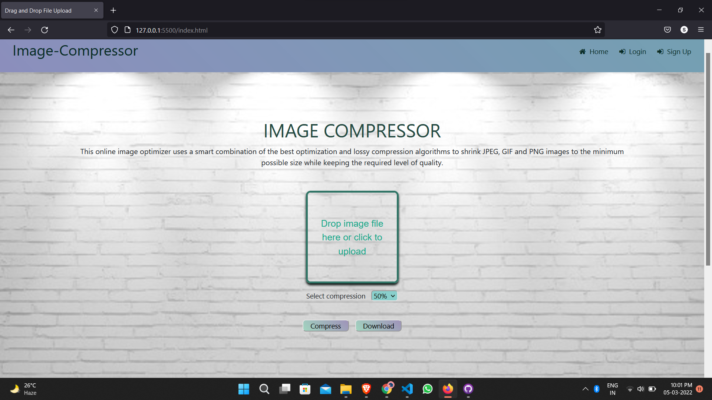

<div align="center">
<a href="#"></a>
</div>
<p align="center">
<br />
<div align="center">
  <a href="https://github.com/shibam-naskar/IMAGE_COMPRESOR">
    
  </a>
  <h1 align="center">Image Compressor</h1>
    <h3 align="center">
    Compress images to the minimum possible size while keeping the required level of quality.
  </h3>
  <a href="https://github.com/shibam-naskar/IMAGE_COMPRESOR"><strong>Explore the docs »</strong></a>
    <br />
</p>

## About The Project

These days, most of the photos generated by our devices are quite large in resolution and in size. As developers, we may not need large images (>5mb) especially if you’re using it for a profile picture or so. A common solution so far was to resize the image after it was uploaded to the server. How about doing this at the client side and compressing the image before it reaches the server?


## Built With

- [HTML](https://html.spec.whatwg.org/multipage/)
- [CSS](https://www.w3.org/Style/CSS/Overview.en.html)
- [JavaScript](https://www.javascript.com/)


## Demo



## File Structure

```
  ├── assets/
        ├──img            contains images   
        ├──UI designs     contains ui's     
  ├── css/
        ├──style.css      all the default styling of index.html
  ├── js/
        ├──main.js        all the functions of index.html
  ├── index.html          main page of the website
```

## Before You Start

- Always maintain the file format & folder structure.
- Maintain proper file names.
- Don't use capital or spaces for files names instead use `_` or `-`.

## Getting Started

Below are the steps to follow to contribute to this project:

**1.** Fork [this](https://github.com/shibam-naskar/IMAGE_COMPRESOR) repository.

**2.** Clone your forked copy of the project.

```
git clone https://github.com/<your_user_name>/IMAGE_COMPRESOR.git
```

where `your_user_name` is your GitHub username.

**3.** Navigate to the project directory.

```
cd IMAGE_COMPRESOR
```

**4.** Add a reference(remote) to the original repository.

```
git remote add upstream https://github.com/shibam-naskar/IMAGE_COMPRESOR.git
```

**5.** Check the remotes for this repository.

```
git remote -v
```

**6.** Always take a pull from the upstream repository to your main branch to keep it at par with the main project(updated repository). Feel free to raise new issues.

```
git pull upstream main
```

**7.** Create a new branch.

```
git checkout -b <your_branch_name>
```

**8.** Make necessary changes and commit those changes

**9.** Track your changes.

```
git add .
```

**10.** Commit your changes .

```
git commit -m "Commit message"
```

**11.** Push the committed changes in your feature branch to your remote repo.

```
git push -u origin <your_branch_name>
```

**12.** To create a pull request, click on `compare and pull requests`. Please ensure you compare your feature branch to the desired branch of the repo you are suppose to make a PR to.

**13.** Add appropriate title and description to your pull request explaining your changes and efforts done.

**14.** Click on `Create Pull Request`.

**15.** And you are done creating a pull request to this project. Be patient while we review your code and merge the changes.

## Roadmap

See the [open issues](https://github.com/shibam-naskar/IMAGE_COMPRESOR/issues) for a list of proposed features (and known issues).

## Contributors

<a href="https://github.com/shibam-naskar/IMAGE_COMPRESOR/graphs/contributors">
  
</a>